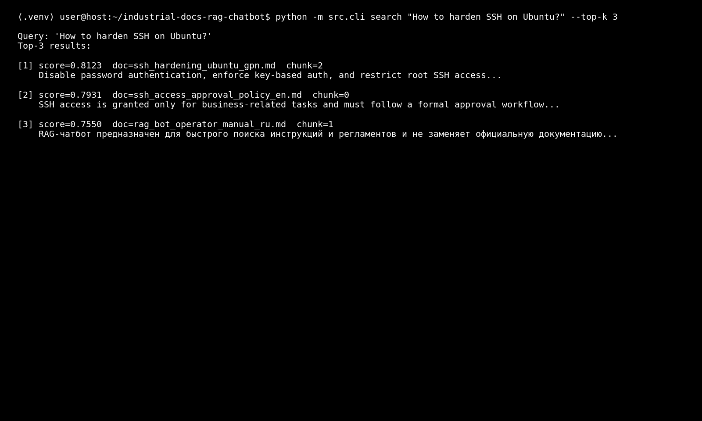
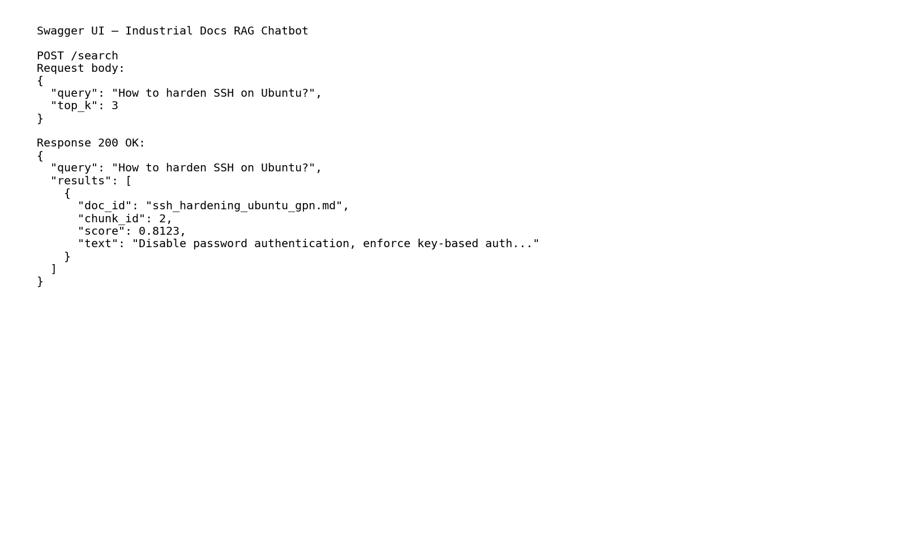
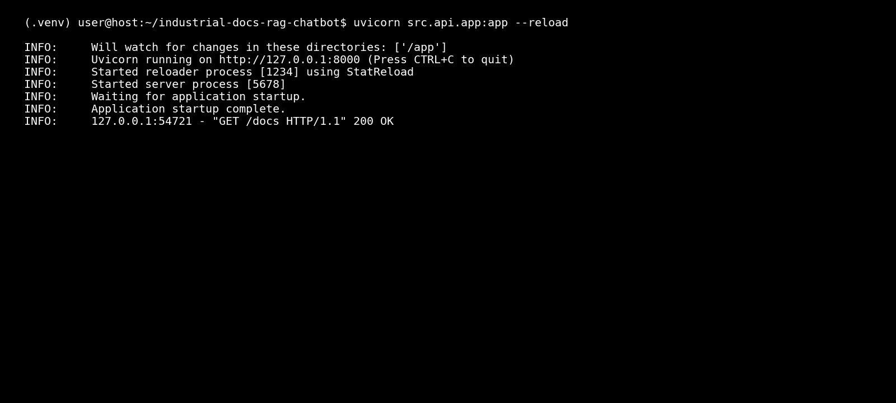

# Industrial Docs RAG Chatbot

Retrieval-augmented search and chat over internal technical / industrial documentation.

This repository contains the **retrieval layer** (embeddings + FAISS index + API + CLI) for a future RAG system focused on industrial / engineering docs (operations, maintenance, safety, SSH policies, data classification, etc.).

The goal is to provide:

- 🧱 clean configuration and path management,
- 🔍 a reusable `VectorRetriever` abstraction,
- 🖥️ a simple CLI for ad-hoc terminal search,
- 🌐 a minimal FastAPI app with `/search` and `/chat` endpoints,
- 🧪 smoke tests and end-to-end tests for retrieval and index building.

The LLM backend and production-grade ingestion pipelines can be plugged in later.


### Optional LLM backend for `/chat`

By default, the `/chat` endpoint still behaves as a **stub**:

- it always includes the phrase `"stub chat endpoint"` in the answer (for tests and local runs);
- it does **not** call any external API when `llm.provider: stub`.

You can enable a minimal end-to-end RAG flow by configuring an OpenAI-compatible backend:


#configs/default.yaml
llm:
  provider: openai
  model_name: gpt-4o-mini          # or any other chat model
  api_base: "https://api.openai.com/v1"
  api_key_env: OPENAI_API_KEY

Then set the API key in your environment:

export OPENAI_API_KEY="sk-..."

The /chat endpoint will:

1. run retrieval to get context chunks;

2. build a simple prompt with the query + context;

3. call POST {api_base}/chat/completions via httpx;

4. return the LLM answer together with the retrieved context.

If the API key is missing or the call fails, the endpoint safely falls back to the historical stub answer.


## Screenshots

### CLI search



### Swagger UI — /search



### Running the API with Uvicorn




## ✨ Features

- 🔍 **Vector search** over a pre-built FAISS index.
  - Default implementation uses a lightweight hash-based encoder.
  - Optional ingestion pipeline uses **Sentence-Transformers** for higher quality.

- ⚙️ **Config-driven setup**  
  `src/config.py` + `configs/default.yaml` define:
  - embedding model, device, batch size,
  - retrieval params (`top_k`),
  - LLM client stub settings.

- 🧱 **Centralized paths**  
  `PATHS` + `AppConfig` keep:
  - project root,
  - `data/raw` (raw docs),
  - `data/index` (FAISS index + metadata),
  - `DEFAULT_CONFIG_PATH` (`configs/default.yaml`).

- 🧪 **Tests included**
  - API smoke tests with dummy retriever (no FAISS needed).
  - End-to-end tests for:
    - index building script,
    - `VectorRetriever` encode/build/save/load/search.

- 🖥️ **CLI search tool**  
  From the project root:

```bash
python -m src.cli search "How to harden SSH on Ubuntu?" --top-k 5


## 🌐 HTTP API (FastAPI + Uvicorn)

- GET /health – health-check.

- POST /search – vector search over the index.

- POST /chat – stub RAG endpoint that calls the retriever and returns a template answer + context.

## 📚 Example industrial corpus (in data/raw/)

- SSH hardening and SSH access policies.

- Pump unit N-250 maintenance regulation.

- Technical incident report templates.

- RAG chatbot operator manuals.

- Data classification guidelines (RU + EN).


## 🧩 Architecture Overview
1. Configuration (src/config.py, configs/default.yaml)

- src/config.py:

- defines Paths:

- project_root

- configs_dir

- raw_data_dir (data/raw)

- index_dir (data/index)

- defines typed config models:

- EmbeddingConfig

- RetrievalConfig

- LLMConfig

- AppConfig

- provides:


PATHS = Paths.from_project_root()
DEFAULT_CONFIG_PATH = PATHS.configs_dir / "default.yaml"

def load_app_config(path: Optional[Path] = None) -> AppConfig:
    ...


- configs/default.yaml (example):

embedding:
  model_name: sentence-transformers/all-MiniLM-L6-v2
  device: cpu
  batch_size: 16

retrieval:
  top_k: 5

llm:
  provider: stub
  model_name: gpt-4o-mini
  api_base: ""
  api_key_env: OPENAI_API_KEY


Configuration is typed via Pydantic and can be overridden via YAML without touching the code.


2. Indexing & Ingestion

There are two ways to build a document index.

2.1 Lightweight index builder (scripts/build_index.py)

- Reads .txt / .md from a given directory.

- Splits text into character-based chunks (with overlap).

- Uses VectorRetriever.encode_texts(...) (hash-based embeddings).

- Builds a FAISS index (IndexFlatIP).

- Writes:

- config.INDEX_PATH – FAISS index (e.g. data/index/faiss_index.bin)

- config.METADATA_PATH – metadata JSONL with:


{
  "doc_id": "...",
  "chunk_id": 0,
  "source_path": "...",
  "text": "chunk text"
}


2.2 Ingestion pipeline with Sentence-Transformers (src/ingest.py)

- Walks through PATHS.raw_data_dir (data/raw).

- Builds paragraph-based overlapping chunks.

- Uses SentenceTransformer from cfg.embedding.model_name:


embeddings = model.encode(
    texts,
    batch_size=cfg.embedding.batch_size,
    show_progress_bar=True,
    convert_to_numpy=True,
    normalize_embeddings=True,
)


- Builds a FAISS index (IndexFlatIP with normalized embeddings).

- Saves:

- data/index/faiss_index.bin

- data/index/metadata.jsonl (row_id, doc_id, chunk_id, …).

You can choose either approach depending on your environment and quality requirements.


3. Vector Retriever (src/retriever.py)

The core abstraction is VectorRetriever.


Key responsibilities:

- encode texts into vectors (current implementation: hash-based, fixed dim=384, L2-normalized);

- build FAISS index (IndexFlatIP);

- save index to disk;

- load index + metadata JSONL;

- run top-k search and return structured results.

Construction helpers:


from src import config
from src.retriever import VectorRetriever

# load index + metadata via paths from src.config
retriever = VectorRetriever.from_config()

# backwards-compatible alias
retriever = VectorRetriever.from_default()

# for index building (no existing index/metadata expected)
builder = VectorRetriever.for_index_building()


Search interface:

results = retriever.search(
    query="Resetting SSH keys on Ubuntu",
    top_k=5,
    with_text=True,  # if metadata contains 'text', it will be included
)

for r in results:
    print(r["rank"], r["score"], r["doc_id"], r["chunk_id"])
    print(r.get("text", ""))


Each result has the form:


{
    "rank": int,
    "score": float,
    "doc_id": str | None,
    "chunk_id": int | None,
    "source_path": str | None,
    "metadata": dict,         # original JSONL record
    "text": str | None,       # present if with_text=True and available
}


4. HTTP API (src/api/app.py)

Minimal FastAPI app exposing the retriever via HTTP.

Endpoints

- GET /health
Returns:

{"status": "ok"}


- POST /search

Request:

{
  "query": "How to harden SSH on Ubuntu?",
  "top_k": 3
}


Response:

{
  "query": "How to harden SSH on Ubuntu?",
  "results": [
    {
      "doc_id": "ssh_hardening_ubuntu_gpn.md",
      "chunk_id": 2,
      "score": 0.8123,
      "text": "Disable password authentication, enforce key-based auth..."
    }
  ]
}


- POST /chat (stub RAG endpoint)

For now, /chat:

- runs retrieval with the given query,

- returns a stub answer string,

- includes retrieved chunks as context.

Request:

{
  "query": "Explain SSH hardening on Ubuntu using internal docs.",
  "top_k": 5
}


Response (example):

{
  "query": "Explain SSH hardening on Ubuntu using internal docs.",
  "answer": "This is a stub chat endpoint response. Your query was: 'Explain SSH hardening on Ubuntu using internal docs.' In a full RAG pipeline, this would call an LLM with the retrieved context.",
  "context": [
    {
      "doc_id": "ssh_hardening_ubuntu_gpn.md",
      "chunk_id": 2,
      "score": 0.8123,
      "text": "Disable password authentication, enforce key-based auth..."
    }
  ]
}


In tests, get_retriever() is monkeypatched to use a DummyRetriever so that no real FAISS index or embeddings are required.


5. CLI (src/cli.py)

A simple CLI is provided for quick terminal search.

Usage (from the project root):

python -m src.cli search "How to harden SSH on Ubuntu?" --top-k 5


What it does:

- loads VectorRetriever via VectorRetriever.from_default(),

- runs search(query, top_k=...),

- prints score, doc_id, chunk_id and a short snippet of the text for each hit.

Example output:

Query: 'How to harden SSH on Ubuntu?'
Top-3 results:

[1] score=0.8123  doc=ssh_hardening_ubuntu_gpn.md  chunk=2
    Disable password authentication, enforce key-based auth, and restrict root SSH access via PermitRootLogin no...

[2] score=0.7931  doc=ssh_access_approval_policy_en.md  chunk=0
    SSH access is granted only for business-related tasks and must follow a formal approval workflow...

[3] score=0.7550  doc=rag_bot_operator_manual_ru.md  chunk=1
    RAG-чатбот предназначен для быстрого поиска инструкций и регламентов и не заменяет официальную документацию...


6. Example industrial corpus (data/raw/)

The repository can be used with your own documents, but it also supports an example corpus for oil & gas / industrial operations.

Suggested files under data/raw/:

data/
  raw/
    ssh_hardening_ubuntu_gpn.md
    ssh_hardening_ubuntu_gpn_en.md
    ssh_access_approval_policy_ru.md
    ssh_access_approval_policy_en.md
    pump_unit_maintenance_regulation_ru.md
    pump_unit_maintenance_regulation_en.md
    incident_report_template_ru.md
    incident_report_template_en.md
    rag_bot_operator_manual_ru.md
    rag_bot_operator_manual_en.md
    data_classification_guideline_ru.md
    data_classification_guideline_en.md
    ...
  index/
    faiss_index.bin       # generated
    metadata.jsonl        # generated

These documents illustrate typical industrial topics: SSH security, equipment maintenance, incident reporting, RAG usage, and data classification (RU + EN).

## 📁 Project Structure

```text
industrial-docs-rag-chatbot/
├─ configs/
│  └─ default.yaml              # embedding / retrieval / LLM settings
├─ data/
│  ├─ raw/                      # raw docs (.txt, .md) – industrial examples (RU + EN)
│  └─ index/                    # faiss_index.bin + metadata.jsonl (generated)
├─ docs/
│  ├─ Overview_EN.md            # English project overview (optional)
│  └─ Overview_RU.md            # Russian project overview
│  └─ images/
│     └─ cli_search_example.png
│     └─ swagger_search_example.png
│     └─ uvicorn_run_example.png
├─ scripts/
│  └─ build_index.py            # lightweight index builder (hash-based embeddings)
├─ src/
│  ├─ __init__.py
│  ├─ config.py                 # Paths + AppConfig (embedding / retrieval / LLM)
│  ├─ retriever.py              # VectorRetriever: encode / build / save / load / search
│  ├─ cli.py                    # CLI entry point: `search` command
│  ├─ ingest.py                 # ingestion pipeline using Sentence-Transformers
│  └─ api/
│     └─ app.py                 # FastAPI app: /health, /search, /chat (stub)
├─ tests/
│  ├─ test_api_smoke.py                 # API smoke tests with DummyRetriever
│  ├─ test_build_index_script.py        # e2e test for scripts/build_index.py
│  └─ test_retriever_encode_and_search.py  # e2e test for VectorRetriever
├─ requirements.txt              # runtime dependencies (FastAPI, FAISS, etc.)
├─ requirements-dev.txt          # dev deps: pytest, httpx, black, mypy, etc.
├─ pytest.ini                    # pytest configuration
├─ CHANGELOG.md                  # version history (optional)
├─ LICENSE                       # MIT license (or your choice)
└─ README.md                     # this file

```

## 🚀 Installation
1. Create and activate a virtual environment (recommended)

python -m venv .venv
source .venv/bin/activate      # Linux/macOS
 #.venv\Scripts\activate       # Windows

2. Install dependencies

Runtime:
pip install -r requirements.txt

Development (tests, linters, etc.):

pip install -r requirements-dev.txt


## 🏗️ Building the Document Index

Before the API or CLI can search anything, you need a FAISS index and metadata.

You can either use the lightweight builder or the full ingestion pipeline.

Option A — Lightweight index builder (scripts/build_index.py)

python -m scripts.build_index \
  --input-dir data/raw

- Where:

--input-dir is a directory with .txt / .md files (e.g., exported internal docs, manuals, procedures).

The script will:

1. Recursively scan input-dir for text files.

2. Split each document into overlapping character chunks.

3. Compute hash-based embeddings via VectorRetriever.encode_texts(...).

4. Build a FAISS index and save it to config.INDEX_PATH.

5. Write a JSONL metadata file to config.METADATA_PATH with doc_id, chunk_id, source_path, and text.

Option B — Ingestion pipeline with Sentence-Transformers (src/ingest.py)

python -m src.ingest


The script will:

1. Read all docs from PATHS.raw_data_dir (defaults to data/raw/).

2. Build paragraph-based overlapping chunks.

3. Compute high-quality embeddings using the model configured in configs/default.yaml.

4. Build a FAISS index.

5. Save:

data/index/faiss_index.bin

data/index/metadata.jsonl

After the index is built, the API will be able to load it via VectorRetriever.from_config() and serve real search results.


## 🌐 Running the HTTP API

From the project root:

uvicorn src.api.app:app --reload


Then open:

- Swagger UI: http://127.0.0.1:8000/docs

- ReDoc: http://127.0.0.1:8000/redoc

You can:

- check GET /health,

- play with POST /search,

- try the stub POST /chat.


## 🧪 Testing

Tests live under tests/:

- test_api_smoke.py – smoke tests for FastAPI app using a DummyRetriever (no FAISS required).

- test_build_index_script.py – end-to-end test for scripts/build_index.py:

- builds an index from temporary .txt / .md docs,

- verifies index and metadata files are created and non-empty.

- test_retriever_encode_and_search.py – end-to-end test for VectorRetriever:

- encodes dummy texts,

- builds and saves a FAISS index + metadata,

- loads a new retriever and runs top-k search,

- checks normalization, determinism, and metadata consistency.

Run all tests:

pytest


Run only API smoke tests:

pytest tests/test_api_smoke.py


## 🗺️ Roadmap

Planned extensions (not all implemented yet):

✅ basic CLI search and FastAPI HTTP layer

✅ lightweight index builder and Sentence-Transformers ingestion pipeline

✅ retrieval e2e tests (encode → index → search)

🔲 real LLM backend for /chat (OpenAI / local model)

🔲 reranking on top of vector search

🔲 evaluation harness for retrieval quality (R@k, MRR, etc.)

🔲 Dockerfile and deployment examples (on-prem / cloud)

🔲 role-aware access control and audit for sensitive docs


### Docker 

A minimal Dockerfile is provided to run the FastAPI service in a container.

Build the image:

docker build -t industrial-docs-rag .

Run the container:

docker run --rm -p 8000:8000 industrial-docs-rag

The API will be available at http://127.0.0.1:8000, with Swagger UI at /docs.

To enable a real LLM backend inside the container, pass the API key as an environment variable:

docker run --rm -p 8000:8000 \
  -e OPENAI_API_KEY="sk-..." \
  industrial-docs-rag


## Versioning

Current version: **v0.2.0** (first public release).

Version numbers follow the MAJOR.MINOR.PATCH scheme.  
Details: [CHANGELOG.md](./CHANGELOG.md).

## [0.1.0] - 2025-11-24
- Initial industrial RAG skeleton: config, VectorRetriever, CLI, FastAPI API, index builders, example industrial docs and tests.


## 📄 License

This project is licensed under the MIT License.
See LICENSE for the full text.
